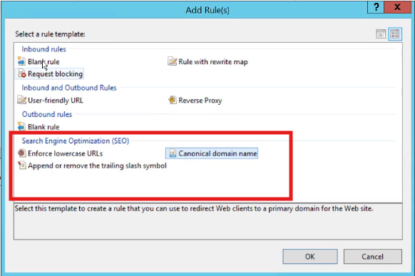

[mod_rewrite Cheat Sheet by DaveChild](https://cheatography.com/davechild/cheat-sheets/mod-rewrite/)

- Components 

- list of predefined actions  

- https  redirect  

- redirect to a custom maintaince page 

### samples 
[Reference](https://gist.github.com/greggnakamura/d96bd052097fd9d75593)

<rewrite>
  <!-- Have a bunch of redirects?  Put them in a separate file -->
  <rules configSource="Rewrites.config" />

  <rules>
  
    <!-- Simple rewrite -->
    <rule name="Simple rewrite" stopProcessing="true">
      <match url="^path/sub path/page\.aspx$" />
      <action type="Rewrite" url="/newpath.aspx" />
    </rule>
    
    <!-- Simple redirect -->
    <rule name="Simple redirect" stopProcessing="true">
      <match url="^path/sub path/page\.aspx$" />
      <action type="Redirect" url="/newpath.aspx" />
    </rule>
    
    <!-- Based on query string -->
    <rule name="Based on query string" stopProcessing="true">
      <match url="^path/sub path/page\.aspx$" />
      <conditions>
        <add input="{QUERY_STRING}" pattern="^parameter=value$" />
      </conditions>
      <action type="Redirect" url="/newpage.aspx" appendQueryString="false" />
    </rule>
    
    <!-- Based on host name -->
    <rule name="Based on host name" stopProcessing="true">
      <match url="^path/sub path/page\.aspx$" />
      <conditions>
        <add input="{HOST_NAME}" pattern="^(www)?mydomain\.net$" />
      </conditions>
      <action type="Redirect" url="http://www.mydomain.com/newpage.aspx"  />
    </rule>
    
    <!-- Canonical redirect -->
    <rule name="Canonical redirect" stopProcessing="true">
      <match url="(.*)" />  
      <conditions>
        <add input="{HOST_NAME}" pattern="^www\.mydomain\.com$" negate="true" />
      </conditions>
      <action type="Redirect" url="http://www.mydomain.com/{R:1}"  />
    </rule>
    
    <!-- Canonical redirect with exception -->
    <rule name="Canonical redirect with exception" stopProcessing="true">
      <match url="(.*)" />  
      <conditions logicalGrouping="MatchAll">
        <add input="{HOST_NAME}" pattern="^www\.mydomain\.com$" negate="true" />
        <add input="{REQUEST_URI}" pattern="^/dont-redirect-me$" negate="true" />
      </conditions>
      <action type="Redirect" url="http://www.mydomain.com/{R:1}"  />
    </rule>

    <!-- Force HTTPS -->
    <rule name="Force HTTPS" stopProcessing="true">
      <match url="(.*)" />
      <conditions>
        <add input="{HTTPS}" pattern="^OFF$" />
      </conditions>
      <action type="Redirect" url="https://{HTTP_HOST}/{R:1}" />
    </rule>
  
    <!-- Stop hot-links -->
    <rule name="Stop hot-links">  
      <match url=".*\.(gif|jpg|png)$"/>  
      <conditions>  
        <add input="{HTTP_REFERER}" pattern="^$" negate="true" />  
        <add input="{HTTP_REFERER}" pattern="^http://mydomain\.com/.*$" negate="true" />  
      </conditions>  
      <action type="Rewrite" url="/images/troll_face.png" />  
    </rule>
    
  </rules>
</rewrite>