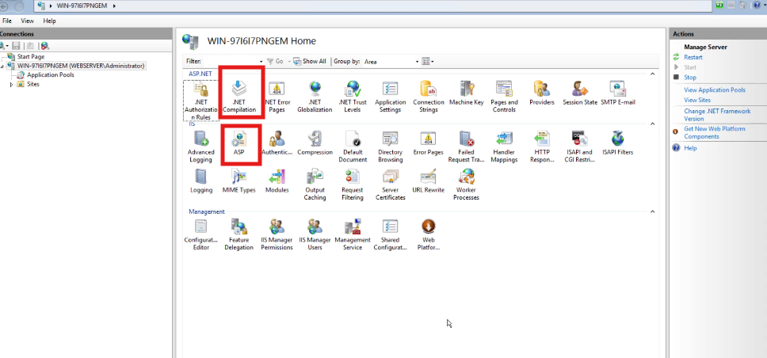
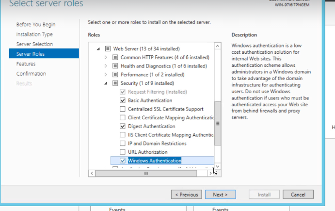
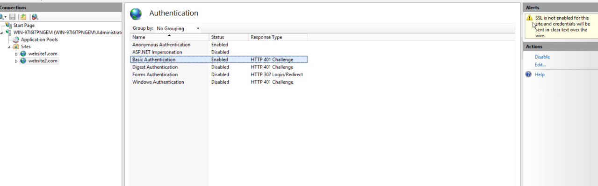

### performance 
##### debuge 

- .Net compilation 
    1. Debug = False
- ASP 
    1. debug properties 
        - enable client side debuging: False 
        - enable server side debuging: False

##### Security authontication 

- Basic and Digest authontication are the same except for degist we have to a domain (AD) 
> basic authontication is not encrypted   
