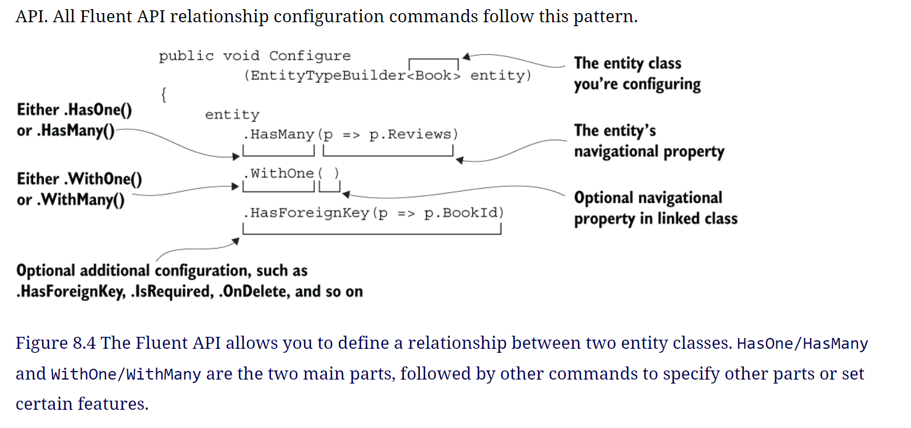
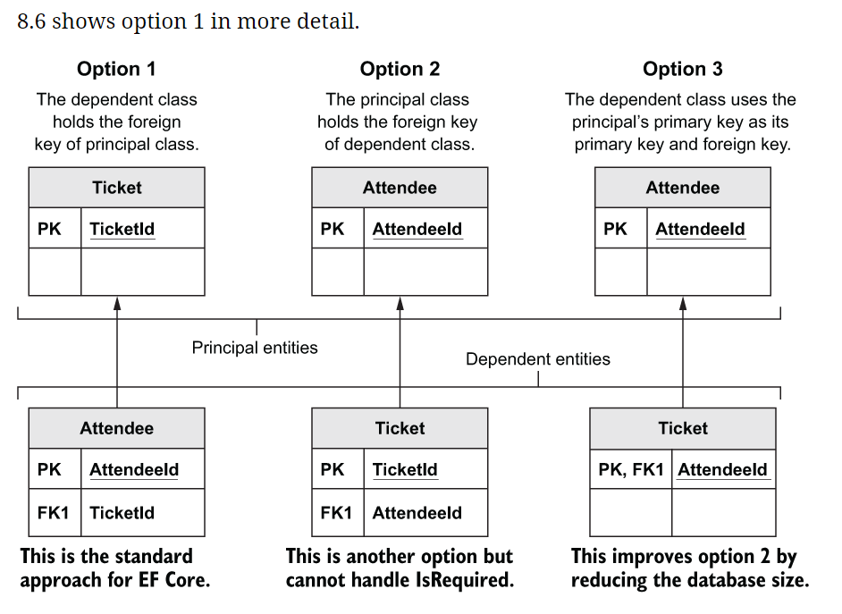

#### What type of configuration run at the first time the dbcontext used 
   first time you use the application’s DbContext where are three configuration approaches: By Convention, Data Annotations, and the Fluent API will be discovered 
    - convention 
      like `Id, NavigationId` those properties will be used as primary key and foreign key 
    - by annotation 
      using `System.ComponentModel.DataAnnotations` to add annotation like `required, maxlength` and more 
    - by fluent API 
      like overried the configuration on DbContext 'OnModelCreating'

##### Value conversions: 
  - **Changing data to/from the database and Enum to string in db**
    ```
    var utcConverter = new ValueConverter<DateTime, DateTime>(toDb => toDb, fromDb => DateTime.SpecifyKind(fromDb, DateTimeKind.Utc));     
 
    modelBuilder.Entity<Product>()                
        .Property(e => e.CreatedAt)                 
        .HasConversion(utcConverter);


    modelBuilder.Entity<Product>()
                .Property(e => e.ProductType)
                .HasConversion<string>();
    ```
  - **more reference need to be revisied**
    - [value conversion](https://learn.microsoft.com/en-us/ef/core/modeling/value-conversions?tabs=data-annotations) 
    - [Value Comparers](https://learn.microsoft.com/en-us/ef/core/modeling/value-comparers?tabs=ef5)
##### You want to map an entity class to a read-only SQL View
  To set an entity class explicitly as read-only, you can use the fluent API HasNoKey() command or apply the attribute [Keyless] to the entity class. And if your entity class doesn’t have a primary key, you must mark it as read-only, using either of the two approaches
  ```
    modelBuilder.Entity<MyEntityClass>()
    .ToView("MyView");
  ```
  - **Index type**
  

  - **more configuration over index**
    ```
      modelBuilder.Entity<MyClass>()
      .HasIndex(p => p.MyProp)
      .IsUnique()
      .HasFilter(“NOT SoftDeleted");
    ```

  - **Define the table name**
    ```
      [Table("XXX")]public class Book ... etc.


      modelBuilder.Entity<Book>().ToTable("XXX");
    ```
  - **Define the default scheme for table**
    ```
      modelBuilder.HasDefaultSchema("NewSchemaName");

      [Table("SpecialOrder", Schema = "sales")] class MyClass ... etc.

      modelBuilder.Entity<MyClass>() .ToTable("SpecialOrder", schema: "sales");

    ```
  - **Configuring the database column names in a table**
    ```
      [Column("SpecialCol")]public int BookId { get; set; }

      modelBuilder.Entity<MyClass>() .Property(b => b.BookId) .HasColumnName("SpecialCol");
    ```
  - **Query Filter(Using Global Query Filters in real-world situations)**
    enable the multitanant, and disappear the sotdelete items 
  - **Applying Fluent API commands based on the database provider type**
    - due to database provider difference we studied this information 
      The following listing is an example of applying the decimal to double type change if the database is SQLite. This code allows the Book App’s OrderBooksBy query object method to use an in-memory SQLite database.
    ```
      protected override void OnModelCreating ModelBuilder modelBuilder) {
          //... put your normal configration here
          if (Database.IsSqlite())               
          {                                     
              modelBuilder.Entity<Book>()        
                  .Property(e => e.Price)        
                  .HasConversion<double>();      
              modelBuilder.Entity<PriceOffer>()  
                  .Property(e => e.NewPrice)     
                  .HasConversion<double>();      
          }
      }
    ```
  - **Shadow properties: Hiding column data inside EF Core**
    - Shadow properties allow you to access database columns without having them appear in the entity class as a property.
    - Shadow properties allow you to “hide” data that you consider not to be part of the normal use of the entity class. 
    - This is all about good software practice: you let upper layers access only the data they need, and you hide anything that those layers don’t need to know about.
    - **Example**
      The tracking data you receive is separate from the primary use of the class, so you may decide to implement that data by using shadow properties, which can be picked up outside the entity class.
      ```
        modelBuilder.Entity<MyEntityClass>()
            .Property<DateTime>("UpdatedOn"); 
      ```
    - **Accessing shadow properties**
      ```
        var entity = new SomeEntityClass();         
        context.Add(entity);                        
        context.Entry(entity)                       
            .Property("UpdatedOn").CurrentValue     
                = DateTime.Now;                     
        context.SaveChanges();  
        // in order by 

        context.MyEntities
        .OrderBy(b => EF.Property<DateTime>(b, "UpdatedOn"))
        .ToList();
      ```
  - **Backing fields: Controlling access to data in an entity class**
    - As you saw earlier, columns in a database table are normally mapped to an entity class property with normal getters and setters
    - But you can also map a private field to your database **This feature is called a backing field**
    - it gives you more control of the way that database data is read or set by the software.
    - it also type of hidding but hide the data from the software this time _Like shadow properties, backing fields hide data_
    - **Examples**
      - _Hiding sensitive data_ —Hiding a person’s date of birth in a private field and making their age in years available to the rest of the software. 
      - Catching changes —Detecting an update of a property by storing the data in a private field and adding code in the setter to detect the update of a property. You will use this technique in chapter 12, when you use property change to trigger an event.
      - Creating Domain-Driven Design (DDD) entity classes —Creating DDD entity classes in which all the entity classes’ properties need to be read-only. Backing fields allow you to lock down navigational collection properties
      
      ```
        EF.Property<DateTime>(entity, "_dateOfBirth") 

        modelBuilder.Entity<Person>()
          .Property("_dateOfBirth")
          .HasColumnName("DateOfBirth");
      ```
    - **Applying value converter to any DateTime property ending in "Utc"**
      ```
        protected override void                                              
        OnModelCreating(ModelBuilder modelBuilder)                           
        {
            var utcConverter = new ValueConverter<DateTime, DateTime>(       
                toDb => toDb,                                                
                fromDb =>                                                    
                    DateTime.SpecifyKind(fromDb, DateTimeKind.Utc));         
        
            foreach (var entityType in modelBuilder.Model.GetEntityTypes())  
            {
                foreach (var entityProperty in entityType.GetProperties())   
                {
                    if (entityProperty.ClrType == typeof(DateTime)           
                        && entityProperty.Name.EndsWith("Utc"))              
                    {                                                        
                        entityProperty.SetValueConverter(utcConverter);      
                    }     
                    if (entityProperty.ClrType == typeof(decimal)          
                        && entityProperty.Name.Contains("Price"))          
                    {                                                      
                        entityProperty.SetPrecision(9);                    
                        entityProperty.SetScale(2);                        
                    }                                                      
            
                    if (entityProperty.ClrType == typeof(string)           
                        && entityProperty.Name.EndsWith("Url"))            
                    {                                                      
                        entityProperty.SetIsUnicode(false);                
                    }                                                            
                    //... other examples left out for clarity
                }
            }
      ```

###### Dbcontext filters before update or create
  for enable soft delete in entityframework we did it in the modelCreating method to ensure we add user id that perform this action 
  ```
      /// Enable soft delete 
      foreach (var entityType in modelBuilder.Model.GetEntityTypes())
      {
          
          //other property code removed for clarity

          if (typeof(ISoftDelete)
          .IsAssignableFrom(entityType.ClrType))

              entityType.AddSoftDeleteQueryFilter(MyQueryFilterTypes.SoftDelete);

          if (typeof(IUserId).IsAssignableFrom(entityType.ClrType))
              entityType.AddSoftDeleteQueryFilter(MyQueryFilterTypes.UserId /*, IUserId*/);
          
      }
  ```
  - class for handle this action 
    ```
      public enum MyQueryFilterTypes { SoftDelete, UserId }
    public static class SoftDeleteQueryExtensions
    {
        public static void AddSoftDeleteQueryFilter(this IMutableEntityType entityData, MyQueryFilterTypes queryFilterType, IUserId userIdProvider = null)
        {
            var methodName = $"Get{queryFilterType}Filter";

            var methodToCall = typeof(SoftDeleteQueryExtensions)
                .GetMethod(methodName, BindingFlags.NonPublic | BindingFlags.Static)
                .MakeGenericMethod(entityData.ClrType);

            var filter = methodToCall.Invoke(null, new object[] { userIdProvider});

            entityData.SetQueryFilter((LambdaExpression)filter);
            
            if (queryFilterType == MyQueryFilterTypes.SoftDelete)
                entityData.AddIndex(entityData.FindProperty(nameof(ISoftDelete.SoftDeleted)));

            if (queryFilterType == MyQueryFilterTypes.UserId)
                entityData.AddIndex(entityData.FindProperty(nameof(IUserId.UserId)));
        }

        private static LambdaExpression GetUserIdFilter<TEntity>(IUserId userIdProvider) where TEntity : class, IUserId
        {
            Expression<Func<TEntity, bool>> filter = x => x.UserId == userIdProvider.UserId;
            return filter;
        }

        private static LambdaExpression GetSoftDeleteFilter<TEntity>( IUserId userIdProvider) where TEntity : class, ISoftDelete
        {
            Expression<Func<TEntity, bool>> filter = x => !x.SoftDeleted;
            return filter;
          }
      } 
    ```
#### Relationship   
  - **Principal key Vs alternate key**
    Principal key —A new term, taken from EF Core’s documentation, that refers to either the primary key, defined in part 1, or the new alternate key, which has a unique value per row and isn’t the primary key
  - **Principal entity**
    The entity that contains the principal-key properties, which the dependent relationship refer to via a foreign key(s)
  - **Dependent entity**
    The entity that contains the foreign-key properties that refer to the principal entity
  - **Principal key**
    the entity has a principal key, also known as the primary key, which is unique for each entity stored in the database
  - **Navigational property**
    A term taken from EF Core’s documentation that refers to the property containing a single entity class, or a collection of entity classes, that EF Core uses to link entity classes
  - **Required relationship**
    A relationship in which the foreign key is non-nullable (and principal entity must exist)
  - **Optional relationship**
    A relationship in which the foreign key is nullable (and principal entity can be missing)
  - **navigation properties**
    navigational property is useful, and some navigational properties aren’t. It is good practice to provide only navigational properties that make sense from the business or software design point of view.
    _Example_
      But do you need a fully defined relationship? From the software design point of view, there are two questions about the Book/Review navigational relationships. The answers to these questions define which navigational relationship you need to include:
      - Does the Book entity class need to know about the Review entity classes? I say yes, because we want to calculate the average review score.
      - Does the Review entity class need to know about the Book entity class? I say no, because in this example application, we don’t do anything with that relationship.
      _My experience is you should add a navigational property only when it makes sense from a business point of view or when you need a navigational property to create (EF Core’s Add) an entity class with a relationship (see section 6.2.1). Minimizing navigational properties will help make the entity classes easier to understand, and more-junior developers won’t be tempted to use relationships that aren’t right for your project._
  - **Configuring relationships By Convention**
    - In this case, you have a public property of type DbSet<Book>, which passed the “must have a valid primary key” test in that it has a public property called BookId.
    - If two navigational properties exist between the two entity classes, the relationship is known as fully defined
    - EF Core can work out By Convention whether it’s a one-to-one or a one-to-many relationship. If only one navigational property exists, EF Core can’t be sure, **so it assumes a one-to-many relationship**.
    - Certain one-to-one relationships may need configuration via the Fluent API if you have only one navigational property or if you want to change the default By Convention setting, such as when you’re deleting an entity class with a relationship
  - **Nullability of foreign keys: Required or optional dependent relationships**
    - defines whether the relationship is required (non-nullable foreign key) or optional (nullable foreign key)
    - For a required relationship, EF Core sets the OnDelete action to Cascade. If the principal entity is deleted, the dependent entity will be deleted too.
    - For a optional relationship, EF Core sets the OnDelete action to ClientSetNull. If the dependent entity is being tracked, the foreign key will be set to null when the principal entity is deleted. But if the dependent entity isn’t being tracked, the database constraint delete setting takes over, and the ClientSetNull setting sets the database rules as though the Restrict setting were in place. The result is that the delete fails at the database level, and an exception is thrown.
  - My unit tests show that one-to-one relationships are rejected if there is no foreign key to link the two entities. Therefore, EF Core’s By Convention won’t set up shadow property foreign keys on one-to-one relationships automatically. **shadow properties becasue there is not navigation property for this relation**
  - If you want to add a foreign key as a shadow property, you can do that via the Fluent API
#### When does By Convention configuration not work?
  - You have composite foreign keys
  - You want to create a one-to-one relationship without navigational links going both ways
  - You want to override the default delete-behavior setting
  - You have two navigational properties going to the same class
  - You want to define a specific database constraint
  - **InverseProperty**
    The Librarian and the borrower of the book (OnLoanTo navigational property) are both represented by the Person entity class. The Librarian navigational property and the OnLoanTo navigational property both link to the same class, and EF Core can’t set up the navigational linking without help. The InverseProperty Data Annotation shown in the following listing provides the information to EF Core when it’s configuring the navigational links.
    ```
      public class LibraryBook
      {
          public int LibraryBookId { get; set; }
          public string Title { get; set; }
      
          public int LibrarianPersonId { get; set; }
          public Person Librarian { get; set; }
      
          public int? OnLoanToPersonId { get; set; }
          public Person OnLoanTo { get; set; }
      }

      public class Person
      {
          public int PersonId { get; set; }
          public string Name { get; set; }
      
          [InverseProperty("Librarian")]      
          public ICollection<LibraryBook> 
              LibrarianBooks { get; set; }
      
          [InverseProperty("OnLoanTo")]       
          public ICollection<LibraryBook> 
              BooksBorrowedByMe { get; set; }
      }
    ```
    _This code is one of those configuration options that you rarely use, but if you have this situation, you must either use it or define the relationship with the Fluent API. Otherwise, EF Core will throw an exception when it starts, as it can’t work out how to configure the relationships._
  ##### 8.6 Fluent API relationship configuration commands
    the Fluent API has a well-designed set of commands that cover all the possible combinations of relationships. It also has extra commands that allow you to define other database constraints.
    

    - **Creating a one-to-one relationship**
      One-to-one relationships can get a little complicated because there are three ways to build them in a relational database. To understand these options, you’ll look at an example in which you have attendees (entity class Attendee) at a software convention, and each attendee has a unique ticket (entity class Ticket).
      -  The principal entities are at the top of the diagram, and the dependent entities are at the bottom.
      - the defined approach
          