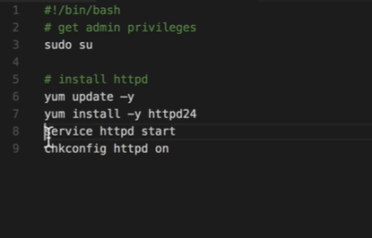

- first go to Amazon machine image (AMI)
- select the free tier machine t2.micro 
- use all the default setting except for the security group you can use the first create one which all ssh and http connection in **inbound rules**
- in the advanced setting you can find the run script (which will be applied during the creation of the machine)
- you can add file with which has the below content
- 
- don't forget to add the bash script at the beginning to tell linux that is a script 